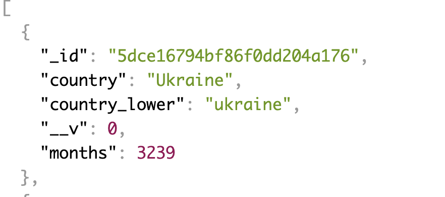

# Global Temperature API

## Description

Using this API you can retrieve monthly temperature averages by country name. The measurements range from around 1750 at the earliest to 2013.

## Country Object

## Features

Features planned during development:

- Ability to retrieve any country and easily access its temperature data by month
- Ability to add new data
- Ability to delete data

## Technologies Used

- MongoDB & Mongoose
- Express
- Node.js

## Installation

1. Clone the library to your computer
2. Use `npm install` to install the dependencies
3. Run the seed file at `global-temperature-api/lib/db/seeds/country.js`
4. From the `lib/` directory run a local server with `nodemon`
5. Open `http://localhost:4000/country` to bring up the index

## Use

The API is currently deployed [here](http://global-temperature-api.herokuapp.com). The site has the following routes:

Where `path` = http://global-temperature-api.herokuapp.com

- `path/country`: the index will return a list of all countries in the API with the number of month values within their `months` array

- `path/country/:name`: this path can be used to access any one country by name. This will return the full object including the full `months` array.

## Contributing

Pull requests are welcome. For any bigger changes please submit an issue.

## Planned Changes

- Add temperature data by city, state, and major city
- Add more routes to allow searches by dates and more searchability of the data
